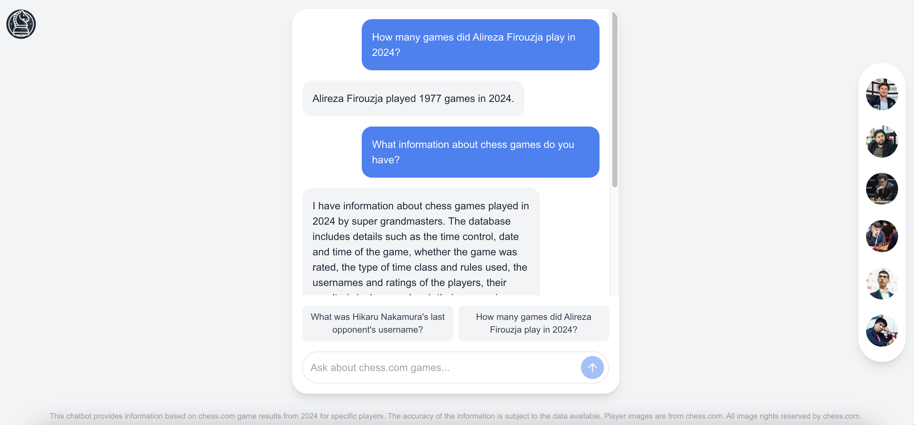

# Chess RAG Project

Welcome to the Chess RAG Project! This project involves the deployment of a chatbot that answers questions regarding chess game results based on real chess data.

## Project Overview

The Chess RAG Project is an innovative web interface featuring an interactive chatbot. Users can query the chatbot in natural language to gain insights into chess games, without the need for any coding. The chatbot includes data from 8 super Grandmasters (GMs), allowing users to ask anything they want to know about their games.

## Features

- **Interactive Chatbot**: Engage with a user-friendly chatbot interface.
- **Real Chess Data**: Access data from 8 super GMs.
- **Natural Language Processing**: Query the chatbot using natural language.
- **Web Interface**: No need to run anything locally; simply use the provided [webpage](https://chess-chatbot.webflow.io/).

## Installation

This GitHub repository contains the backend code, which is designed to run serverlessly on Google Cloud. There is no need for local installation. Simply visit the [webpage](https://chess-chatbot.webflow.io/) to interact with the chatbot.

## Usage

As this is an MVP, the chatbot is best suited for general questions. Edge cases and special queries may not be handled properly yet. Examples of suitable questions will be provided in future updates.

## Contributing

This project is part of a master's course in AI (AI Portfolio Project). While contribution guidelines are still being developed, security issues are always welcome to be flagged.

## License

This project is licensed under the Apache 2.0 License. It is a university demo project, and everyone is welcome to use the code at their own risk.

## Contact

For more information, you can connect with me on [LinkedIn](https://www.linkedin.com/in/keanuforthmann/). 

## Screenshot



## Backend Overview

The backend of the Chess RAG Project is entirely written in Python and is designed to efficiently handle data extraction, processing, and interaction with the chatbot interface.

### Key Components

1. **Data Extraction**:
   - **File**: `chesscom_data_extraction.py`
   - **Functionality**: This script extracts raw chess data for a specified year and player names. The extracted data is saved as `chess_games_raw.csv`.

2. **Data Processing**:
   - **File**: `chess_data_processor.py`
   - **Functionality**: This script processes the raw chess data into a simplified and cleaned format, which is then stored as `chess_games_simple.csv`. This processed data is ready for use by the chatbot.

3. **Chatbot Query Handling**:
   - **Library**: PandasAI
   - **Functionality**: The PandasAI library takes user queries from the frontend and processes them to generate responses from the chatbot. It utilizes the cleaned chess data to provide accurate and insightful answers.

### File Descriptions

- **functions/main.py**: Contains the main functions for data fetching, processing, and analysis, designed to run on Google Cloud Functions.
- **src/data_fetching/chesscom_data_extraction.py**: Handles the extraction of chess data from Chess.com.
- **src/transformation/chess_data_processor.py**: Processes and cleans the raw chess data.
- **src/retrieval/pandasai_retrieval.py**: Manages chatbot queries using the PandasAI library.
- **src/tests/**: Contains test scripts to ensure data integrity and correctness.
- **data/**: Stores raw and processed chess data in CSV format.
- **assets/**: Contains images and other assets for documentation purposes.

### File Structure

Here's a brief overview of the key files in the backend:

```plaintext
your-project/
│
├── functions/
│   └── main.py                  # Main entry point for Google Cloud Functions
│
├── src/
│   ├── data_fetching/
│   │   └── chesscom_data_extraction.py  # Script for extracting chess data from Chess.com
│   ├── transformation/
│   │   └── chess_data_processor.py      # Script for processing and cleaning chess data
│   ├── retrieval/
│   │   └── pandasai_retrieval.py        # Script for handling chatbot queries using PandasAI
│   └── tests/
│       ├── test_csv_processing.py       # Tests for CSV data processing
│       └── chess_games_simple_inspection.py  # Script for inspecting processed chess data
│
├── data/
│   ├── raw/
│   │   └── chess_games_raw.csv          # Raw chess data
│   └── processed/
│       └── chess_games_simple.csv       # Processed and cleaned chess data
│
├── assets/
│   └── chatbot_demo.png                 # Screenshot for README
│
├── README.md                            # Project documentation
└── LICENSE                              # License information
```

### Deployment

The backend is designed to run serverlessly on Google Cloud, ensuring scalability and ease of maintenance. The specific deployment configurations and services used on Google Cloud are abstracted away, allowing users to interact with the chatbot via the provided [webpage](https://chess-chatbot.webflow.io/).

### Special Instructions

- Ensure that the data extraction and processing scripts are run in sequence to maintain data integrity.
- The `chess_games_simple.csv` file is crucial for the chatbot's operation, as it serves as the primary data source for user queries.
